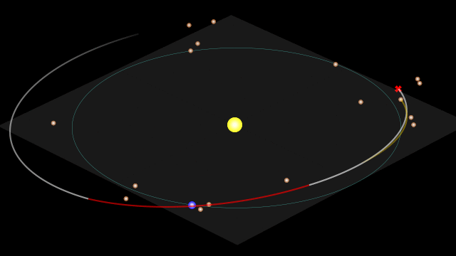

[](http://mybinder.org:/repo/lfsimoes/beam_paco__gtoc5)


# Multi-rendezvous Spacecraft Trajectory Optimization with Beam P-ACO #

This repository contains the code implementing the research described in the paper:

> Luís F. Simões, Dario Izzo, Evert Haasdijk, A. E. Eiben (2017) [Multi-rendezvous Spacecraft Trajectory Optimization with Beam P-ACO][DOI]. In: Hu, B., López-Ibáñez, M. (eds) *Evolutionary Computation in Combinatorial Optimization. EvoCOP 2017*. Lecture Notes in Computer Science, vol. 10197, pp. 141-156. Springer.
>
> [ **[PDF][arXivPDF]** . [DOI][DOI] . [Google Scholar][Scholar] . [arXiv][arXiv] . [ResearchGate][RG] . [BibTeX](#citation) ]
>
> See the [EvoStar'17 presentation slides][slides] for a quick overview of the paper's contributions.

****

[][youtube_vid]<br>
Visualization of the best-found trajectory. See the **[full video on YouTube][youtube_vid]**.<br>
*(the code for generating trajectory videos is available in the [traj_video.ipynb][traj_video.ipynb] notebook)*<br><br>


**Contents**

 - [Code Structure](#code-structure)
   - **[`gtoc5`](#gtoc5)**
   - **[`paco`](#paco)**
   - [`paco_traj.py` & `experiments__paco.py`](#paco_trajpy--experiments__pacopy)
 - [References](#references)
 - [Dependencies](#dependencies)
 - [Citation](#citation)


&nbsp;
## Code Structure ##

For examples of how to use different parts of the code, see the notebook [usage_demos.ipynb][nb_usage_demos.ipynb].

### [`gtoc5`](gtoc5) ###

The GTOC5 acronym refers to the problem posed in the [5th edition of the Global Trajectory Optimization Competition][gtoc5@portal].
It consists of a multi-rendezvous spacecraft trajectory optimization problem, where a spacecraft is tasked with exploring as many asteroids as possible, from among a total of 7075 available ones. The exploration of a single asteroid is carried out in two stages. First, the spacecraft must rendezvous (match position and velocity) with the asteroid, and leave there a scientific payload. Later in the mission, the spacecraft performs a fly-by of the asteroid, and sends a "penetrator" towards it. Upon impact, this penetrator would release a cloud of debris, that would be investigated by the payload left there.

The [`gtoc5`](gtoc5) module provided here contains an implementation of the problem model developed for the competition by the team from the European Space Agency [[2][ref2]].

The module exposes the GTOC5 problem in the form of a black-box combinatorial optimization problem. Its primary goal is the identification of the longest possible sequence of asteroids (ordered, with no repetitions) that can be visited by the spacecraft along its mission, within the GTOC5 problem's imposed constraints.
Creating a GTOC5 trajectory amounts in this module to choosing an Earth launch leg towards an initial asteroid, with [`mission_to_1st_asteroid()`][l_mission_to_1st], and subsequently issuing calls to [`add_asteroid()`][l_add_asteroid], to gradually extend the mission with additional exploration targets.

The problem is characterized by a number of key distinguishing features:

* ***multi-objective***: trajectories are evaluated with respect to number of asteroids explored, final mass, and time of flight (by [`score()`][l_score], [`final_mass()`][l_final_mass] and [`tof()`][l_tof], respectively – see code in [multiobjective.py](gtoc5/multiobjective.py) for ways to handle them);

* ***bilevel optimization***: every time a decision is made in the combinatorial problem to take the spacecraft to a new asteroid, an optimization process is triggered (in [`lambert_optimize_dt()`][l_lambert]). It will "selfishly" pick the solution with smallest ∆V, out from a number of solved [Lambert's problems](https://en.wikipedia.org/wiki/Lambert%27s_problem), and thus define the new rendezvous leg;

* ***dynamic objective function***: the mass and time costs to transfer between two given asteroids varies across (mission) time as asteroids move along their orbits, and also as a function of the spacecraft's state;

* ***constrained objective function***: only a few of the 7075 asteroids will actually be reachable at any given time from a given departure asteroid, and so [`lambert_optimize_dt()`][l_lambert] may often fail to find any feasible solution to create the leg;

* ***inaccurate heuristic***: the indicators provided in [phasing.py](gtoc5/phasing.py) ([Edelbaum][l_edelbaum], [Euclidean][l_euclidean], and [Orbital][l_orbital]) can be used to rate asteroids with respect to their desirability as targets into which to move the spacecraft. These ratings are however only moderately correlated with the ∆V costs obtained by [`lambert_optimize_dt()`][l_lambert]. 


### [`paco`](paco) ###

The [`paco`](paco) module provides a (problem-independent) implementation of the Population-based Ant Colony Optimization algorithm (P-ACO), together with the extensions introduced in the paper: hybridization with Beam Search, and support for multi-objective problems. The different variants are made available through the following classes:

| Class                                    | Algorithm                    |
|:---------------------------------------- |:---------------------------- |
| [`paco`][l_paco]                         | P-ACO, single-objective      |
| [`paco_pareto`][l_paco_pareto]           | P-ACO, multi-objective       |
| [`beam_paco`][l_beam_paco]               | Beam P-ACO, single-objective |
| [`beam_paco_pareto`][l_beam_paco_pareto] | Beam P-ACO, multi-objective  |

Depending upon the parameterization, further algorithm variants may be obtained. An instance of a Beam P-ACO class that uses a setting of `alpha=0.0` will omit the pheromone contributions from its branching decisions. Successor nodes are then chosen probabilistically according to only the problem's heuristic function. This variant is named as **Stochastic Beam** in the paper. If additionally a setting of `prob_greedy=1.0` is used, then that choice is instead deterministic. Nodes will branch towards the `branch_factor` best successors, as determined by the heuristic function, and the algorithm then effectively behaves as a (single- or multi-objective) **Beam Search**.

All problem-specific logic is offloaded in this code into a "path handler" class. A path handler for the Travelling Salesman Problem (TSP) is provided in [`class tsp_path`][l_tsp_path] as example. To apply the algorithms in the module to other combinatorial optimization problems, a similar class should be created, exposing the same interface.


### [`paco_traj.py`](paco_traj.py) & [`experiments__paco.py`](experiments__paco.py) ###

The interfacing between the [`gtoc5`](gtoc5) and [`paco`](paco) modules is achieved via the [`class gtoc5_ant`][l_gtoc5_ant] (single-objective) and [`class gtoc5_ant_pareto`][l_gtoc5_ant_pareto] (multi-objective) path handlers implemented in [paco_traj.py](paco_traj.py).

In [experiments__paco.py](experiments__paco.py) the path handler, and the chosen P-ACO/Beam Search variant are parameterized, instantiated, and deployed for the construction of GTOC5 trajectories.

**Executing [experiments__paco.py](experiments__paco.py) will replicate the paper's [full experimental plan][l_exper_plan].**
<br>*Warning:* doing so will generate 24.8 GB of experimental results.


*[To be added in coming days: code implementing the data analysis of the experimental results.]*


&nbsp;
## References ##

For additional information on the GTOC5 problem, P-ACO or Beam Search, consult the references below.

### GTOC5 / Spacecraft Trajectory Optimization ###

The special issue of the *Acta Futura* journal dedicated to the GTOC5 competition is available [here][AFissue] (open access).<br>
On the GTOC Portal, see the [GTOC5 problem section][gtoc5@portal], and the [Publications][pubs@portal] page for other papers addressing the problem. 

1. Grigoriev, I.S., Zapletin, M.P.: [GTOC5: Problem statement and notes on solution verification][ref1]. *Acta Futura* 8, 9–19 (2014)
2. Izzo, D., Simões, L.F., Yam, C.H., Biscani, F., Di Lorenzo, D., Addis, B., Cassioli, A.: [GTOC5: Results from the European Space Agency and University of Florence][ref2]. *Acta Futura* 8, 45–55 (2014)
3. Izzo, D., Hennes, D., Simões, L.F., Märtens, M.: [Designing complex interplanetary trajectories for the global trajectory optimization competitions][ref3]. In: Fasano, G., Pintér, J.D. (eds.) *Space Engineering: Modeling and Optimization with Case Studies*, pp. 151–176. Springer (2016) [[PDF][ref3_pdf]]

### Population-based Ant Colony Optimization (P-ACO) ###

4. Guntsch, M., Middendorf, M.: [A Population Based Approach for ACO][ref4]. In: Cagnoni, S., Gottlieb, J., Hart, E., Middendorf, M., Raidl, G.R. (eds.) *Applications of Evolutionary Computing: EvoWorkshops 2002: EvoCOP, EvoIASP, EvoSTIM/EvoPLAN*. pp. 72–81. Springer, Berlin, Heidelberg (2002)
5. Guntsch, M., Middendorf, M.: [Applying Population Based ACO to Dynamic Optimization Problems][ref5]. In: Dorigo, M., Di Caro, G., Sampels, M. (eds.) *Ant Algorithms: Third International Workshop, ANTS 2002*. pp. 111–122. Springer, Berlin, Heidelberg (2002)
6. Guntsch, M., Middendorf, M.: [Solving Multi-criteria Optimization Problems with Population-Based ACO][ref6]. In: Fonseca, C.M., Fleming, P.J., Zitzler, E., Thiele, L., Deb, K. (eds.) *Evolutionary Multi-Criterion Optimization: Second International Conference, EMO 2003*. pp. 464–478. Springer, Berlin, Heidelberg (2003)
7. Guntsch, M.: [Ant algorithms in stochastic and multi-criteria environments][ref7]. Ph.D. thesis, Karlsruher Institut für Technologie (2004)
8. Oliveira, S., Hussin, M.S., Stützle, T., Roli, A., Dorigo, M.: [A Detailed Analysis of the Population-Based Ant Colony Optimization Algorithm for the TSP and the QAP][ref8]. Tech. Rep. TR/IRIDIA/2011-006, IRIDIA (Feb 2011) [[support data][ref8supp]]
9. Weise, T., Chiong, R., Lässig, J., Tang, K., Tsutsui, S., Chen, W., Michalewicz, Z., Yao, X.: [Benchmarking optimization algorithms: An open source framework for the traveling salesman problem][ref9]. *IEEE Computational Intelligence Magazine* 9(3), 40–52 (2014) [[GitHub][ref9code]: [PACO.java][ref9code_paco]]

### Beam Search ###

10. Wilt, C.M., Thayer, J.T., Ruml, W.: [A comparison of greedy search algorithms][ref10]. In: *Proceedings of the Third Annual Symposium on Combinatorial Search (SOCS-10)*. pp. 129–136 (2010)


&nbsp;
## Dependencies ##

Below is the list of Python libraries on which the code depends.

#### Experiments (``gtoc5`` and ``paco`` modules, ``paco_traj.py``, ``experiments*.py``): ####

* [PyKEP][pykep] 1.2.2 ([available here][pk122])
* numpy 1.10.4
* scipy 0.17.0
* tqdm 4.7.4

#### Experimental analysis: ####

* pandas 0.18.0
* matplotlib 1.5.1
* seaborn 0.7.1

The experiments reported in the paper were carried out in Python 3.4.4, using the above-listed versions of each library.


&nbsp;
## Citation ##

If you use any of this code in your work, please consider citing:

```
@INPROCEEDINGS{Simoes2017,
  TITLE =     {Multi-rendezvous Spacecraft Trajectory Optimization with {Beam P-ACO}},
  AUTHOR =    {Sim{\~o}es, Lu{\'i}s F. and Izzo, Dario and Haasdijk, Evert and Eiben, A. E.},
  YEAR =      {2017},
  BOOKTITLE = {Evolutionary Computation in Combinatorial Optimization. EvoCOP 2017},
  editor =    {Hu, Bin and L{\'o}pez-Ib{\'a}{\~n}ez, Manuel},
  series =    {Lecture Notes in Computer Science},
  volume =    {10197},
  pages =     {141--156},
  publisher = {Springer},
  address =   {Cham},
  doi =       {10.1007/978-3-319-55453-2_10},
}
```


[arXiv]: https://arxiv.org/abs/1704.00702
[arXivPDF]: https://arxiv.org/pdf/1704.00702.pdf
[DOI]: http://dx.doi.org/10.1007/978-3-319-55453-2_10
[Scholar]: https://scholar.google.com/scholar_lookup?title=Multi-rendezvous%20Spacecraft%20Trajectory%20Optimization%20with%20Beam%20P-ACO
[RG]: https://www.researchgate.net/publication/315071181_Multi-rendezvous_Spacecraft_Trajectory_Optimization_with_Beam_P-ACO

[slides]: https://docs.google.com/presentation/d/1-ZcQm7BuM38j1Tg1yjzUBP6FSRPKvArLISemKRUUUIk/edit?usp=sharing

[youtube_vid]: https://www.youtube.com/watch?v=WdmbczsFyto
[traj_video.ipynb]: https://nbviewer.jupyter.org/github/lfsimoes/beam_paco__gtoc5/blob/master/traj_video.ipynb

[nb_usage_demos.ipynb]: https://nbviewer.jupyter.org/github/lfsimoes/beam_paco__gtoc5/blob/master/usage_demos.ipynb

[gtoc5@portal]: https://sophia.estec.esa.int/gtoc_portal/?page_id=25
[pubs@portal]: https://sophia.estec.esa.int/gtoc_portal/?page_id=312
[AFissue]: http://dx.doi.org/10.2420/ACT-BOK-AF08

[ref1]: http://dx.doi.org/10.2420/AF08.2014.9
[ref2]: http://dx.doi.org/10.2420/AF08.2014.45
[ref3]: http://dx.doi.org/10.1007/978-3-319-41508-6_6
[ref3_pdf]: https://arxiv.org/pdf/1511.00821.pdf

[ref4]: http://dx.doi.org/10.1007/3-540-46004-7_8
[ref5]: http://dx.doi.org/10.1007/3-540-45724-0_10
[ref6]: http://dx.doi.org/10.1007/3-540-36970-8_33
[ref7]: http://d-nb.info/1013929756
[ref8]: http://iridia.ulb.ac.be/IridiaTrSeries/link/IridiaTr2011-006.pdf
[ref8supp]: http://iridia.ulb.ac.be/supp/IridiaSupp2011-010/
[ref9]: http://dx.doi.org/10.1109/MCI.2014.2326101
[ref9code]: https://github.com/optimizationBenchmarking/tspSuite
[ref9code_paco]: https://github.com/optimizationBenchmarking/tspSuite/blob/master/src/main/java/org/logisticPlanning/tsp/solving/algorithms/metaheuristics/permutation/paco/PACO.java

[ref10]: http://www.aaai.org/ocs/index.php/SOCS/SOCS10/paper/viewFile/2101/2515

[pykep]: https://esa.github.io/pykep/
[pk122]: https://github.com/esa/pykep/releases/tag/1.2.2


<!--- .code_locations.py -->
[l_mission_to_1st]: gtoc5/gtoc5.py#L64
[l_add_asteroid]: gtoc5/gtoc5.py#L125
[l_score]: gtoc5/gtoc5.py#L42
[l_final_mass]: gtoc5/gtoc5.py#L27
[l_tof]: gtoc5/gtoc5.py#L32
[l_lambert]: gtoc5/lambert.py#L169
[l_edelbaum]: gtoc5/phasing.py#L44
[l_euclidean]: gtoc5/phasing.py#L130
[l_orbital]: gtoc5/phasing.py#L176
[l_paco]: paco/paco.py#L132
[l_paco_pareto]: paco/paco.py#L628
[l_beam_paco]: paco/paco.py#L391
[l_beam_paco_pareto]: paco/paco.py#L632
[l_tsp_path]: paco/paco.py#L15
[l_gtoc5_ant]: paco_traj.py#L393
[l_gtoc5_ant_pareto]: paco_traj.py#L516
[l_exper_plan]: experiments__paco.py#L336
